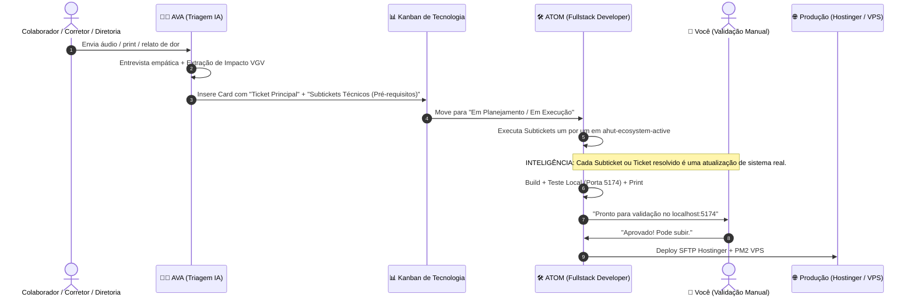

# 👑 Pipeline Status & Governança — Orquestrador Chief

* **Ecossistema:** Ahut / ApeXfy / Estate.ia CRM
* **Ambiente Ativo:** Local Dev Server (`http://localhost:5174/tecnologia`)
* **Status do Squad:** 🟢 Operando em Sincronia

---

## 🔄 Fluxo de Esteira Ágil (End-to-End) com Suporte a Subtickets

---

## 📝 Ata de Reunião: Alinhamento Incidente Wesley (Contatos Duplicados)
**Participantes:** ORQUESTRADOR, AVA e ATOM.
**Decisão:** O problema crítico que estava fragmentando conversas devido à criação manual de contatos duplicados foi diagnosticado. 
A AVA formatou a solicitação técnica e o ATOM estruturou a demanda em um Ticket Principal (Resolução Contatos Duplicados) com **10 Subtickets/Pré-requisitos**, movidos para a fila "A Executar". O Orquestrador validou a clareza deste formato (Ticket + Subtickets), monitorando a entrega em tempo real.
